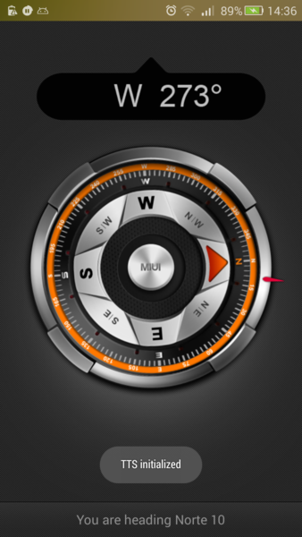
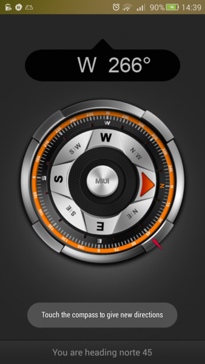
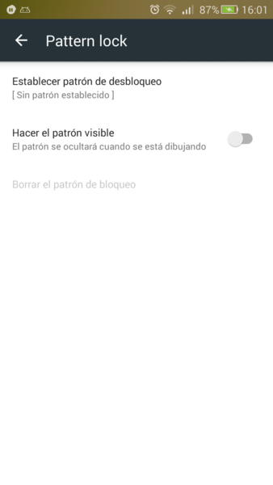
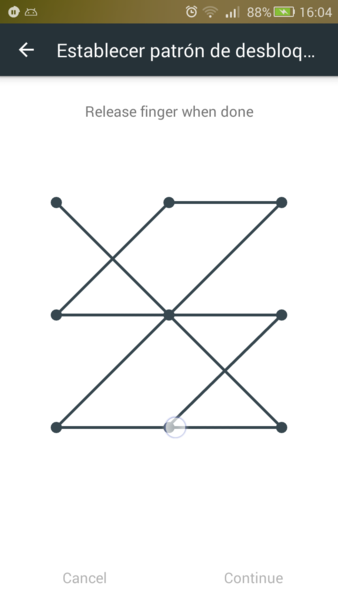
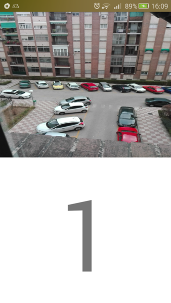

# Tutoriales de las aplicaciones Android

## BrujulaCompass

Para realizar esta aplicación se ha tomado como base la brújula de la _ROM_ MIUI. Se le ha añadido el reconocimiento de voz (_ASR_) y se modificó la la interfaz de la brújula para que mostrara hacia donde tiene que dirigirse el usuario en función del comando de voz. Veamos la primera pantalla:

### Inicio de la aplicación


Al mostrarse esta pantalla, el usuario debe proporcionar un comando de voz, por ejemplo _“Norte 10”_. Tras dar el comando, en la brujula se añadirá un marcador indicando dónde está el Norte + 10 grados. Además de esto, mediante una voz, se le irá indicando al usuario si debe girar a la derecha/izquierda o va en la dirección correcta:



Como vemos en la imagen, aparece un indicador rojo situado en el norte + 10 grados. Veamos otro ejemplo, Norte 45:



Para dar nuevas instrucciones de voz basta con tocar la brújula.

En la parte inferior de la pantalla, aparece el comando de voz reconocido.

### Implementación

Se han necesitado de tres clases, La principal que implementa la actividad (`CompassActivity`), donde reside prácticamente toda la lógica de la aplicación. En ella se hace uso de los sensores magnético y el acelerómetro. La otra clase ha es una extensión de la clase `ImageVew` para crear nuestra propia vista, en este caso el compás y el indicador de la dirección indicada por el usuario.

#### Clase CompassActivity.java

Esta clase es la principal y en la que se realiza toda la lógica, en ella se declarar y registran los sensores a usar (El magnético y el acelerómetro). Ambos se obtienen en el método `onCreate` del siguiente modo:

```java
private SensorManager mSensorManager;
private Sensor mMagneticSensor;
private Sensor mAccelerometer;

//...

mSensorManager = (SensorManager) getSystemService(Context.SENSOR_SERVICE);
mMagneticSensor = mSensorManager.getDefaultSensor(Sensor.TYPE_MAGNETIC_FIELD);
mAccelerometer = mSensorManager.getDefaultSensor(Sensor.TYPE_ACCELEROMETER);
```

Para poder obtener actualizaciones frecuentes de los datos de los sensores es necesario declarar un `SensorEventListener` y registrarlo en el sistema, declararemos un único _listener_ que será usado por los dos sensores:

```java
private SensorEventListener mMagneticSensorEventListener = new SensorEventListener() {

		@Override
		public void onSensorChanged(SensorEvent event) {

				if (event.sensor == mMagneticSensor) {
						System.arraycopy(event.values, 0, mLastMagnetometer, 0, event.values.length);
						mLastMagnetometerSet = true;
				} else if (event.sensor == mAccelerometer) {
						System.arraycopy(event.values, 0, mLastAccelerometer, 0, event.values.length);
						mLastAccelerometerSet = true;
				}

				if (mLastAccelerometerSet && mLastMagnetometerSet) {
						SensorManager.getRotationMatrix(mR, null, mLastAccelerometer, mLastMagnetometer);
						SensorManager.getOrientation(mR, mOrientation);
						float azimuthInRadians = mOrientation[0];
						float azimuthInDegress = (float) (Math.toDegrees(azimuthInRadians) + 360) % 360;

						mTargetDirection = -azimuthInDegress;
				}
		}

		@Override
		public void onAccuracyChanged(Sensor sensor, int accuracy) {
		}
};
```

La función `onSensorChanged` será llamada cada vez que se actualicen los datos de los sensores.

Una vez tenemos una referencia a los sensores y el _listener_ creado, hay que registrarlos en el método `onResume` y des-registrarlos en el `onPause`:

```java
@Override
protected void onResume() {
		super.onResume();

		if (mMagneticSensor != null) {
				mSensorManager.registerListener(mMagneticSensorEventListener, mMagneticSensor,
								SensorManager.SENSOR_DELAY_GAME);
		}
		if (mAccelerometer != null) {
				mSensorManager.registerListener(mMagneticSensorEventListener, mAccelerometer,
								SensorManager.SENSOR_DELAY_GAME);
		}
		// ...
}

@Override
protected void onPause() {
		super.onPause();

		if (mMagneticSensor != null) {
				mSensorManager.unregisterListener(mMagneticSensorEventListener);
		}
		if (mAccelerometer != null) {
				mSensorManager.unregisterListener(mMagneticSensorEventListener);
		}

		// ...
}
```

El reconocimiento de voz se inicializa en el siguiente método:

```java
/**
 * Starts listening for any user input.
 * When it recognizes something, the <code>processAsrResult</code> method is invoked.
 * If there is any error, the <code>processAsrError</code> method is invoked.
 */
private void startListening() {
		Intent intent = new Intent(RecognizerIntent.ACTION_RECOGNIZE_SPEECH);
		intent.putExtra(RecognizerIntent.EXTRA_LANGUAGE_MODEL, RecognizerIntent.LANGUAGE_MODEL_FREE_FORM);
		intent.putExtra(RecognizerIntent.EXTRA_PROMPT, getString(R.string.asr_prompt));
		intent.putExtra(RecognizerIntent.EXTRA_MAX_RESULTS, 2);

		try {
				startActivityForResult(intent, REQUEST_RECOGNIZE);
		} catch (ActivityNotFoundException e) {
				//If no recognizer exists, download from Google Play
				showDownloadDialog();
		}
}
```

Esto intentará lanzar el reconocedor de voz, si el dispositivo no lo tiene instalado lanzará un diálogo pidiendo al usuario que lo instale:

```java
private void showDownloadDialog() {
		AlertDialog.Builder builder =
						new AlertDialog.Builder(this);
		builder.setTitle(R.string.asr_download_title);
		builder.setMessage(R.string.asr_download_msg);
		builder.setPositiveButton(android.R.string.yes,
						new DialogInterface.OnClickListener() {
								@Override
								public void onClick(DialogInterface dialog,
																		int which) {
										//Download, for example, Google Voice Search
										Intent marketIntent =
														new Intent(Intent.ACTION_VIEW);
										marketIntent.setData(
														Uri.parse("market://details?"
																		+ "id=com.google.android.voicesearch"));
								}
						});
		builder.setNegativeButton(android.R.string.no, null);
		builder.create().show();
}
```

Una vez que el usuario habla, se recoge el resultado en el `onActivityResult` y decidimos cómo interpretarlo, en este caso se parsea de forma bastante primitiva si el usuario dijo _este, norte, sur u oeste_ junto al número de grados:

```java
@Override
protected void onActivityResult(int requestCode, int resultCode, Intent data) {
		if (requestCode == REQUEST_RECOGNIZE &&
						resultCode == Activity.RESULT_OK) {
				ArrayList<String> matches =
								data.getStringArrayListExtra(RecognizerIntent.EXTRA_RESULTS);

				String[] tokens = matches.get(0).split(" ");

				if (tokens.length == 2) {
						mHeadedDirection = Float.parseFloat(tokens[1]);
						mLocationTextView.setText(String.format(getString(R.string.heading_text), matches.get(0)));

						switch (tokens[0].toLowerCase()) {
								case "este":
										mHeadedDirection += 90;
										break;
								case "sur":
								case "surf":
										mHeadedDirection += 180;
										break;
								case "oeste":
										mHeadedDirection += 270;
										break;
						}

						Toast.makeText(this, R.string.asr_ask_again,
										Toast.LENGTH_LONG).show();

				} else {
						Toast.makeText(this, R.string.asr_error,
										Toast.LENGTH_LONG).show();
				}
		}
}
```

El punto cardinal junto con los grados servirán para situar el indicador que muestre al usuario hacia dónde debe dirigirse.

Para lograr el efecto de giro de la brújula, se rota la imagen con cada actualización de los sensores:

```java
protected Runnable mCompassViewUpdater = new Runnable() {
		@Override
		public void run() {
				if (mPointer != null && !mStopDrawing) {
						if (mDirection != mTargetDirection) {

								// calculate the short routine
								float to = mTargetDirection;
								if (to - mDirection > 180) {
										to -= 360;
								} else if (to - mDirection < -180) {
										to += 360;
								}

								// limit the max speed to MAX_ROTATE_DEGREE
								float distance = to - mDirection;
								float MAX_ROATE_DEGREE = 1.0f;
								if (Math.abs(distance) > MAX_ROATE_DEGREE) {
										distance = distance > 0 ? MAX_ROATE_DEGREE : (-1.0f * MAX_ROATE_DEGREE);
								}

								// need to slow down if the distance is short
								mDirection = normalizeDegree(mDirection
												+ ((to - mDirection) * mInterpolator.getInterpolation(Math
												.abs(distance) > MAX_ROATE_DEGREE ? 0.4f : 0.3f)));
								mPointer.updateDirection(mDirection);

								if (mHeadedDirection != -1) {
										mUserHint.updateDirection(mDirection + mHeadedDirection);
								}
						}
						updateDirection();
						mHandlerCompass.postDelayed(mCompassViewUpdater, 20);
				}
		}
};
```

Como vemos, el `Runnable` se llama a sí mismo para mantenerse en ejecución `mHandlerCompass.postDelayed(mCompassViewUpdater, 20);`, de igual modo, habrá que escibir esta línea en el método `onResume`.

Los métodos `updateDirection` son métodos definidos en las clases que veremos ahora, que representan la brujula y el indicador.

#### Clase CompassView.java

Los dos métodos más importantes de esta clase son:

```java
@Override
protected void onDraw(Canvas canvas) {
		if (compass == null) {
				compass = getDrawable();
				compass.setBounds(0, 0, getWidth(), getHeight());
		}

		canvas.save();
		canvas.rotate(mDirection, getWidth() / 2, getHeight() / 2);
		compass.draw(canvas);
		canvas.restore();
}

public void updateDirection(float direction) {
		mDirection = direction;
		invalidate();
}
```

que se encargan de rotar la brújula cada vez que se llama al método `updateDirection` desde el `Runnable` visto anteriormente.

### Referencias

- Comass de MIUI \| [github.com/MiCode](https://github.com/MiCode/Compass "Código en github")
- Pro Android 5 \| [amazon.es](http://www.amazon.es/gp/product/1430246804/ref=as_li_ss_tl?ie=UTF8&camp=3626&creative=24822&creativeASIN=1430246804&linkCode=as2&tag=bmab-21 "Ver libro en Amazon")
- Código de la aplicación \| [github.com/algui91/BrujulaCompass](https://github.com/algui91/grado_informatica_npi/tree/master/Android/BrujulaCompass "Código en Github para BrujulaCompass")

## GPSQR

En esta aplicación se lee un destino mediante códigos QR, tras esto, se puede iniciar la navegación con _Google Maps_ (Usando la librería [Android-GoogleDirectionLibrary](https://github.com/akexorcist/Android-GoogleDirectionLibrary)). En la aplicación se muestran dos mapas. En el de abajo aparece el destino al que debemos llegar, además, se va dibujando un camino por el que el usuario va pasando. En el mapa de arriba se ve el mapa desde el punto de vista _StreetView_. Veamos la aplicación:


El _Floating Action Button_ de abajo a la izquierda lanza el lector de QRs, que usa una simplificación de la librería _Zxing_. Cuando se escanea una localización, veremos lo siguiente:


Una vez leido el QR, solo resta pulsar el marcador rojo para iniciar la navegación con _Google Maps_. La ruta calculada por la _API_ de _Google_ es la azul, mientras que la ruta real tomada por el usuario aparecerá en rojo.

<!--Fotos de la ruta-->

## Photo Gesture

Para realizar esta aplicación se ha usado una librería llamada [PatterLock](https://github.com/DreaminginCodeZH/PatternLock).

En esta aplicación se le pide al usuario que establezca un patrón de bloqueo, puede ser tan complejo como el patrón de bloqueo usado en Android. Una vez establecido, cuando se introduzca correctamente la aplicación tomará una foto a los 3 segundos. A continuación mostramos la pantalla principal de la aplicación.


Al pulsar _“Establecer patrón”_ veremos lo siguiente:



Es posible hacer que el patrón no sea visible cuando lo introducimos, para añadir una capa extra de seguridad.

Cuando pulsemos _Establecer patrón_ se nos pedirá que lo dibujemos dos veces, para confirmarlo:



Hecho esto, cuando volvamos a la pantalla principal, en lugar de “Establecer patrón” aparecerá “Echar foto”. Si pulsamos sobre ese botón, se nos pide el patrón establecido. Si se introduce bien, aparecerá la cámara con una cuenta atrás, al llegar a 0 se echará una foto:



La foto se guardará en la galería.

## Movement Sound

En esta aplicación se usa el acelerómetro y el giroscopio, para mostrar sus valores por pantalla. El giroscopio es capaz de detectar una rotación del dispositivo, al hacerlo, reproduce un sonido. Por contra, el acelerómetro detecta una sacudida del dispositivo y reproduce un sonido distinto.


